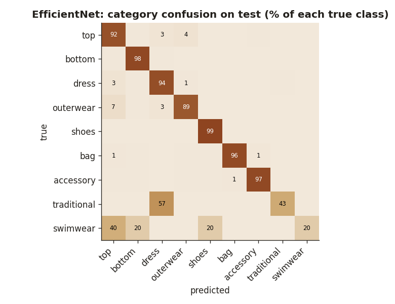

# EfficientNet classifier: evaluation

EfficientNet-B0 (ImageNet weights, fine-tuned), best val epoch 5. Scores on the 29,633 **test** pictures (duplicate copies left out). Both models are scored on exactly the same pictures: those that have a FashionCLIP vector (29,633; Fashionpedia crops under 32 px have none). sub_category is restricted to the children of the predicted category for EfficientNet, as the app shows it.

## category

| dataset | test items | EfficientNet | FashionCLIP probe |
|---|---:|---:|---:|
| Fashion Product | 3,549 | 98.6% (98–99) | 96.3% (96–97) |
| PolyVore | 11,922 | 97.7% (97–98) | 94.8% (94–95) |
| Fashionpedia | 14,162 | 93.2% (93–94) | 80.8% (80–81) |
| **all** | 29,633 | **95.7% (95–96)** | **88.3% (88–89)** |
| balanced accuracy | | 80.9% | 73.0% |

Used by the app: **efficientnet**.

Small classes (too few test items to trust the percentage): traditional 3/7 right, swimwear 1/5 right.

## sub_category

| dataset | test items | EfficientNet | FashionCLIP probe |
|---|---:|---:|---:|
| Fashion Product | 3,549 | 89.2% (88–90) | 88.1% (87–89) |
| PolyVore | 4,268 | 94.3% (94–95) | 93.6% (93–94) |
| Fashionpedia | 8,411 | 81.2% (80–82) | 69.1% (68–70) |
| **all** | 16,228 | **86.4% (86–87)** | **79.7% (79–80)** |
| balanced accuracy | | 79.8% | 78.4% |

Used by the app: **efficientnet**.

## pattern

| dataset | test items | EfficientNet | FashionCLIP probe |
|---|---:|---:|---:|
| Fashion Product | 644 | 82.9% (80–86) | 72.4% (69–76) |
| Fashionpedia | 7,200 | 87.1% (86–88) | 74.4% (73–75) |
| **all** | 7,844 | **86.8% (86–88)** | **74.2% (73–75)** |
| balanced accuracy | | 77.0% | 74.7% |

Used by the app: **efficientnet**.
