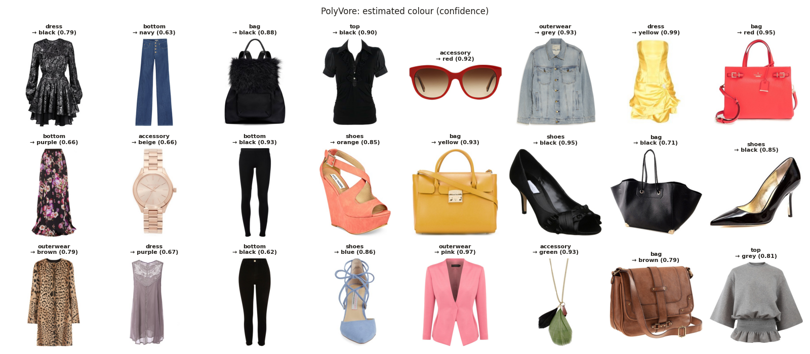
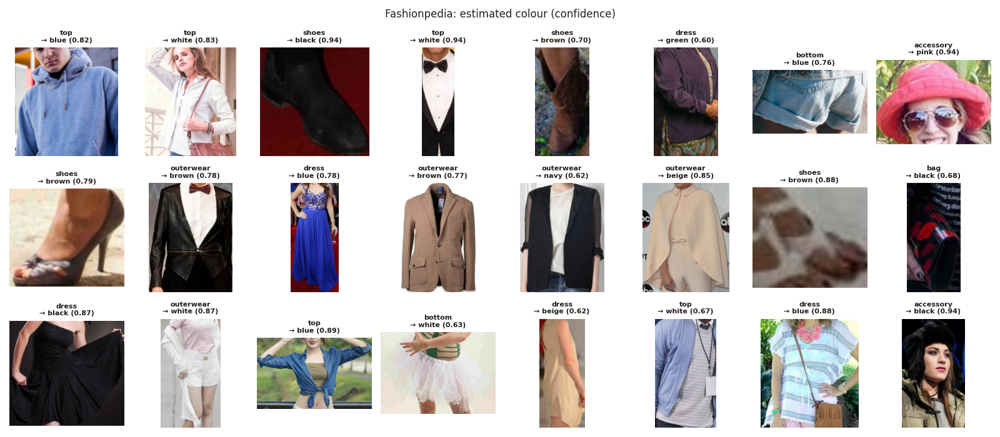

# Colour estimation (PolyVore, Fashionpedia)

Model: gradient boosting on Lab colour histograms, trained on Fashion Product images (train split) with their real colour labels. Script: `src/estimate_colours.py`.

## Accuracy on Fashion Product (val + test, unseen images)

- All predictions: **62.4%** on 7639 images.

| minimum confidence | colour filled | accuracy |
|---:|---:|---:|
| 0.0 | 100% | 62.4% |
| 0.4 | 84% | 68.5% |
| 0.5 | 71% | 73.4% |
| 0.6 ← used | 57% | 78.5% |
| 0.7 | 45% | 82.7% |

Accuracy per true colour (confidence ≥ 0.6):

| colour | images | accuracy |
|---|---:|---:|
| black | 1109 | 85% |
| blue | 511 | 74% |
| white | 497 | 71% |
| brown | 335 | 83% |
| green | 276 | 87% |
| red | 262 | 82% |
| grey | 220 | 63% |
| pink | 198 | 80% |
| purple | 195 | 88% |
| navy | 166 | 71% |
| silver | 127 | 73% |
| yellow | 123 | 92% |
| orange | 69 | 75% |
| gold | 63 | 73% |
| beige | 52 | 35% |
| cream | 42 | 60% |
| olive | 40 | 88% |
| burgundy | 34 | 62% |
| multicolour | 15 | 40% |
| teal | 15 | 60% |
| khaki | 8 | 50% |

Fashion Product photos are tiny (60x80) and often show a model, so these numbers are a rough guide. PolyVore (product shots on white) should be similar; Fashionpedia (street photos, shadows) is probably lower: check the grids below.

## PolyVore

- Colour filled for **62.2%** of the 125910 items with pixels (confidence ≥ 0.6).
- Top colours: black 25.2%, blue 8.5%, white 8.4%, brown 7.7%, beige 6.5%, red 5.9%, pink 5.8%, gold 4.5%, silver 3.7%, grey 3.7%

## Fashionpedia

- Colour filled for **58.8%** of the 104250 items with pixels (confidence ≥ 0.6).
- Top colours: black 28.6%, brown 13.9%, white 9.9%, blue 9.0%, navy 9.0%, purple 5.8%, red 4.6%, pink 3.7%, beige 2.7%, grey 2.6%

