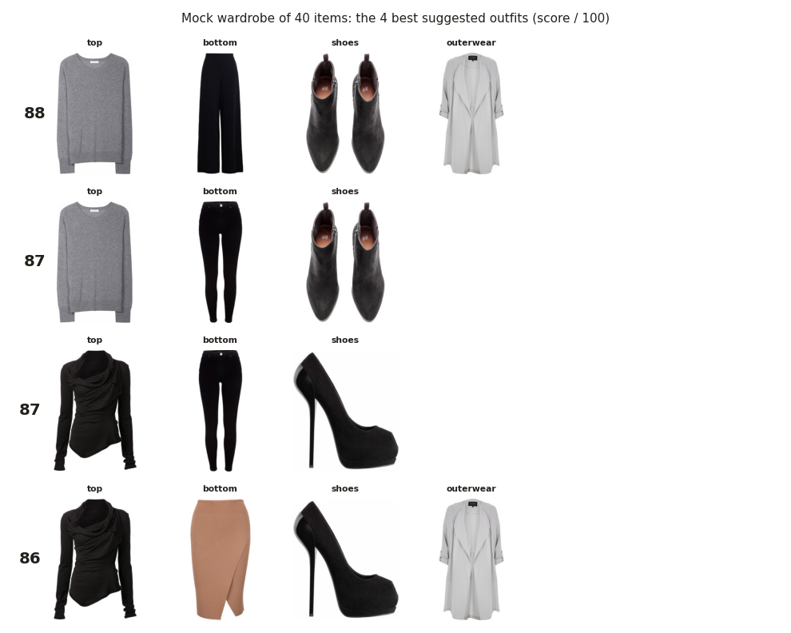

# Compatibility formula: evaluation

Weights and rules from `mappings/` (team values): style 0.35, colour 0.3, pattern 0.15, structure 0.2.

AUC = how often a real outfit beats the same outfit with one item swapped for a random item of the same category (0.5 = chance). FITB = picking the hidden item among 4 of the same category (25% = chance). 95% intervals in brackets.

## PolyVore (904 test outfits)

| weights | AUC | FITB |
|---|---:|---:|
| **team weights** | **66.6% (63–70)** | **42.6% (39–46)** |
| style alone (904 outfits where it applies) | 72.9% (70–76) | 49.7% (46–53) |
| colour alone (449 outfits where it applies) | 52.0% (47–57) | 28.5% (25–33) |
| pattern alone (741 outfits where it applies) | 50.3% (47–54) | 25.5% (22–29) |
| structure alone (904 outfits where it applies) | 50.0% (47–53) | 25.0% (22–28) |
| learned reference: style 0.96, colour 0.04, pattern 0.0, structure 0.0 | 72.7% (70–75) | 49.2% (46–52) |

## Fashionpedia (2,710 test outfits)

| weights | AUC | FITB |
|---|---:|---:|
| **team weights** | **78.7% (77–80)** | **59.5% (58–61)** |
| style alone (2,710 outfits where it applies) | 84.6% (83–86) | 70.0% (68–72) |
| colour alone (895 outfits where it applies) | 51.2% (48–54) | 27.2% (24–30) |
| pattern alone (2,678 outfits where it applies) | 50.0% (48–52) | 25.1% (23–27) |
| structure alone (2,710 outfits where it applies) | 50.0% (48–52) | 25.0% (23–27) |
| learned reference: style 0.95, colour 0.05, pattern 0.0, structure 0.0 | 84.6% (83–86) | 70.1% (68–72) |

## Style scale

Average FashionCLIP similarity inside real PolyVore test outfits: 5th percentile 0.35, median 0.44, 95th percentile 0.55. The CSV maps 0.2 → 0 and 0.8 → 1.

## Demo: mock wardrobe

40 PolyVore test items (10 tops, 7 bottoms, 4 dresses, 4 outerwear, 7 shoes, 4 bags, 4 accessories).

**Should I buy this?** Random test items as friperie candidates:

| candidate | colour | verdict | good outfits where it beats what you own | best score |
|---|---|---|---:|---:|
| top | teal | **skip** | 0 | 87 |
| bottom | ? | **skip** | 0 | 85 |
| shoes | black | **skip** | 0 | 85 |
| bag | black | **buy** | 54 | 86 |
| outerwear | ? | **buy** | 38 | 88 |
