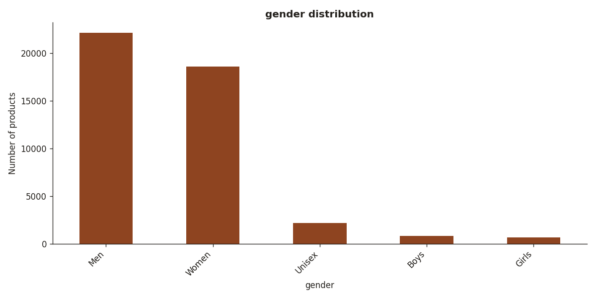
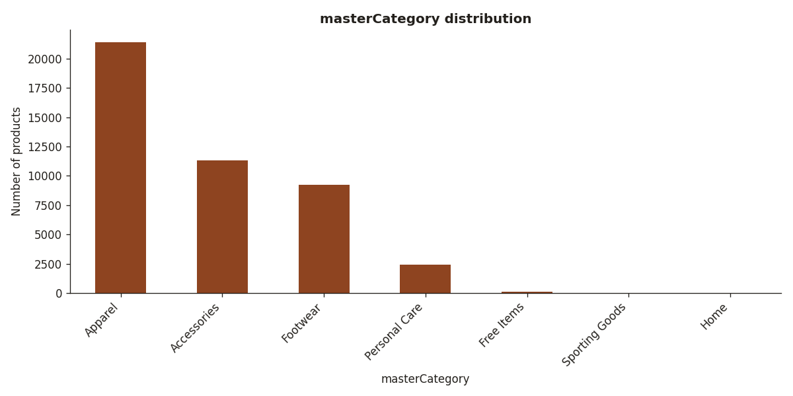
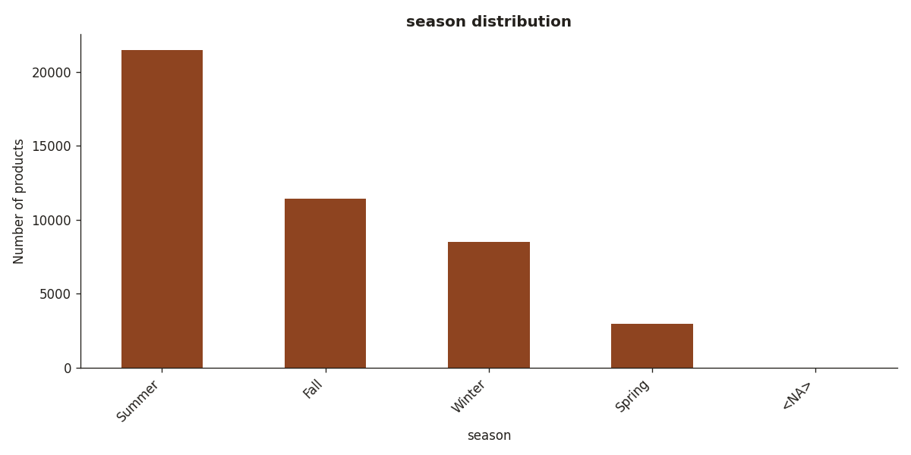
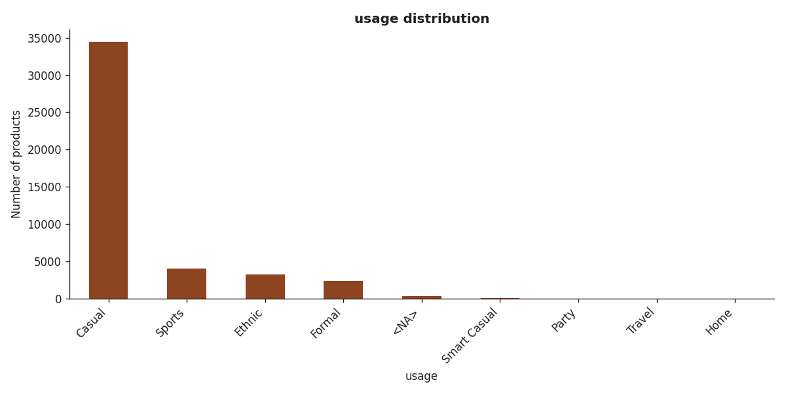
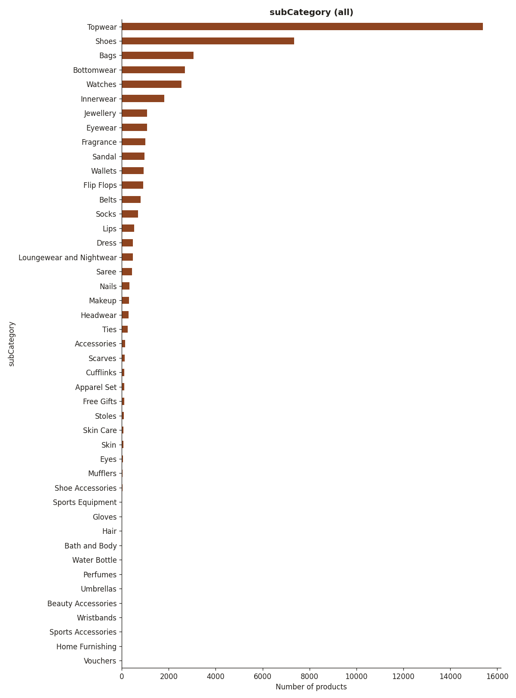
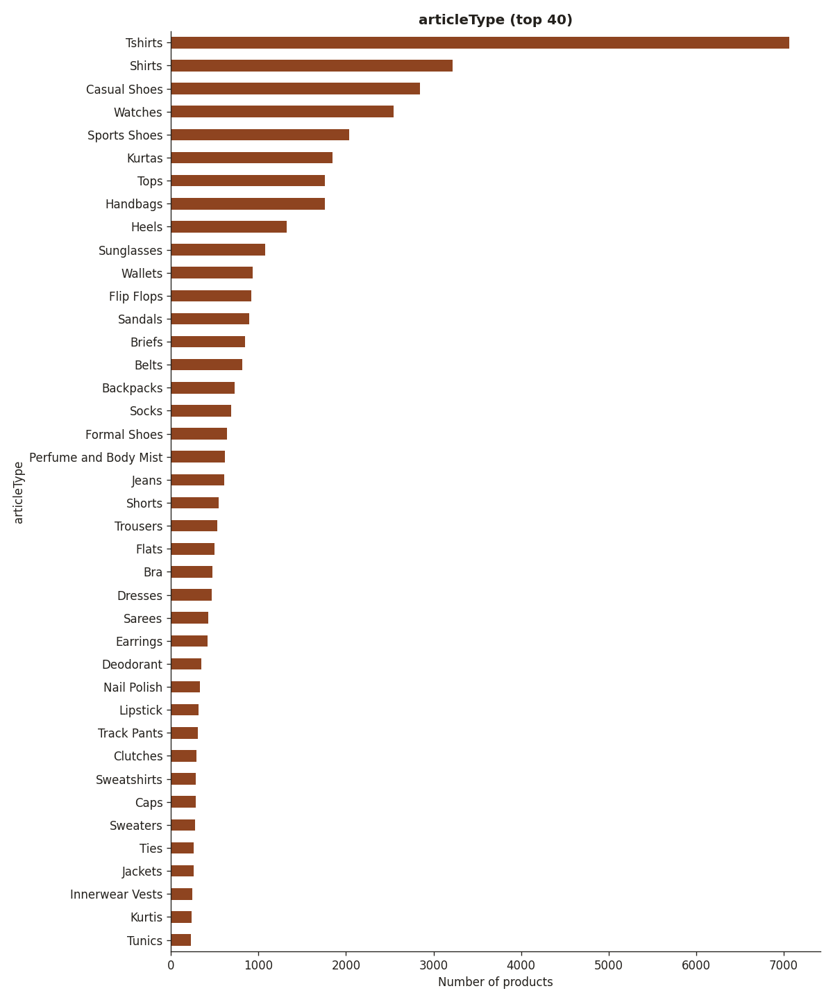
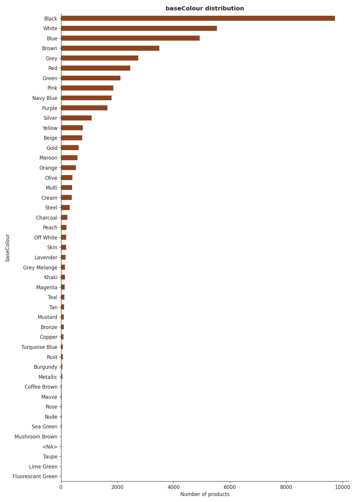
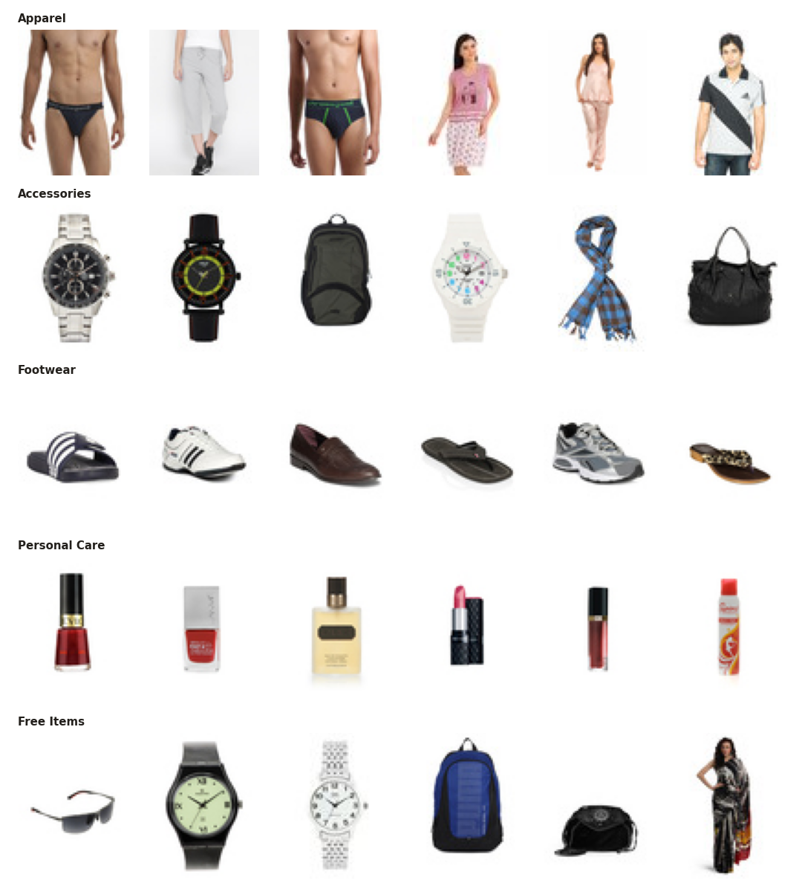

# EDA — Fashion Product Images (Small)

## Size and quality

- Products (rows): **44446**
- Columns: id, gender, masterCategory, subCategory, articleType, baseColour, season, year, usage, productDisplayName
- Rows repaired (commas inside product name): 22
- Duplicate ids: 0
- Missing values: `baseColour` = 15, `season` = 21, `year` = 1, `usage` = 317, `productDisplayName` = 7
- Image files: 44441
- Rows without image: 5 [12347, 39401, 39403, 39410, 39425]
- Images without row: 0
- Usable products (row + image): **44441**

## Class balance

### gender

| gender | count | % |
|---|---:|---:|
| Men | 22160 | 49.9 |
| Women | 18632 | 41.9 |
| Unisex | 2164 | 4.9 |
| Boys | 830 | 1.9 |
| Girls | 655 | 1.5 |

### masterCategory

| masterCategory | count | % |
|---|---:|---:|
| Apparel | 21395 | 48.1 |
| Accessories | 11289 | 25.4 |
| Footwear | 9222 | 20.8 |
| Personal Care | 2404 | 5.4 |
| Free Items | 105 | 0.2 |
| Sporting Goods | 25 | 0.1 |
| Home | 1 | 0.0 |

### season

| season | count | % |
|---|---:|---:|
| Summer | 21474 | 48.3 |
| Fall | 11445 | 25.8 |
| Winter | 8517 | 19.2 |
| Spring | 2984 | 6.7 |
| <NA> | 21 | 0.0 |

### usage

| usage | count | % |
|---|---:|---:|
| Casual | 34409 | 77.4 |
| Sports | 4025 | 9.1 |
| Ethnic | 3208 | 7.2 |
| Formal | 2359 | 5.3 |
| <NA> | 317 | 0.7 |
| Smart Casual | 67 | 0.2 |
| Party | 29 | 0.1 |
| Travel | 26 | 0.1 |
| Home | 1 | 0.0 |

### subCategory

- 45 sub-categories; largest: Topwear (15401), smallest: Vouchers (1)

### articleType

- 142 article types, 72 of them have fewer than 50 images (too few to train on alone: merge or drop when mapping).
- Top 10: Tshirts (7069), Shirts (3215), Casual Shoes (2846), Watches (2542), Sports Shoes (2036), Kurtas (1844), Tops (1762), Handbags (1759), Heels (1323), Sunglasses (1073)

- Off-topic rows (Personal Care, Home, Sporting Goods): **2430**: candidates to drop.
- 'Free Items' rows: 105: real clothes/accessories (e.g. Free Gifts, Ties, Backpacks, Handbags), map them by articleType.

## Colour distribution

- 46 distinct colour names (our unified palette has ~20, so they must be grouped).
- Top 10: Black (21.9%), White (12.5%), Blue (11.1%), Brown (7.9%), Grey (6.2%), Red (5.5%), Green (4.8%), Pink (4.2%), Navy Blue (4.0%), Purple (3.7%)
- Black share here: 21.9% (survey: black present in 84% of wardrobes).

## Year

- 2007: 2, 2008: 7, 2009: 20, 2010: 845, 2011: 13689, 2012: 16290, 2013: 1212, 2014: 234, 2015: 2780, 2016: 6006, 2017: 2917, 2018: 405, 2019: 33

## Images (random sample of 500)

- Sizes (w x h): 60x80: 500
- Colour modes: RGB: 492, L: 8
- All images are catalogue shots on white background: very different from friperie phone photos, so our own photos stay in the test set.

