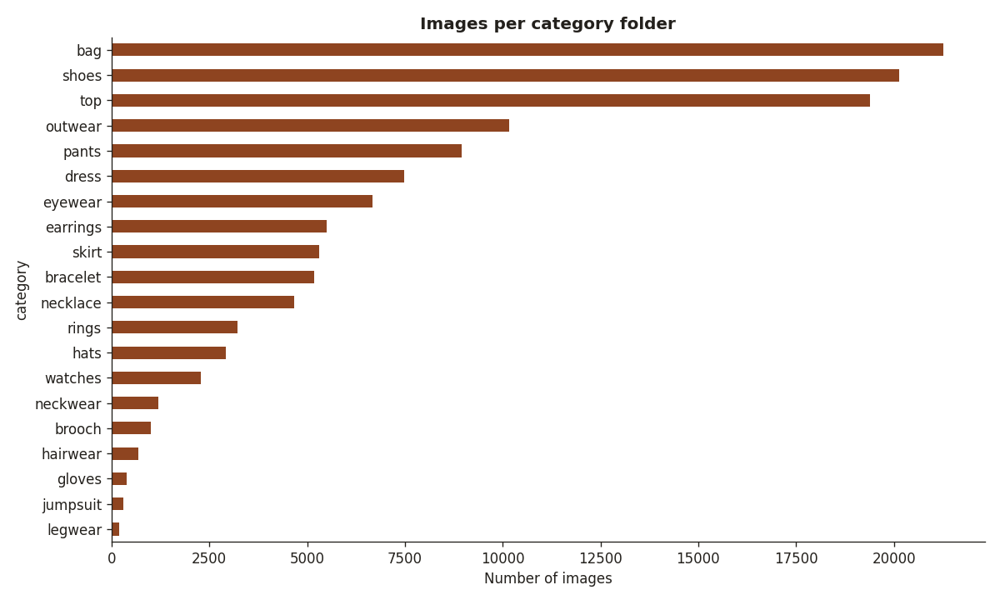
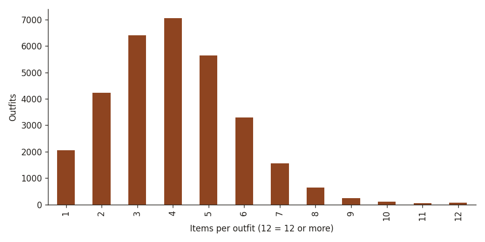
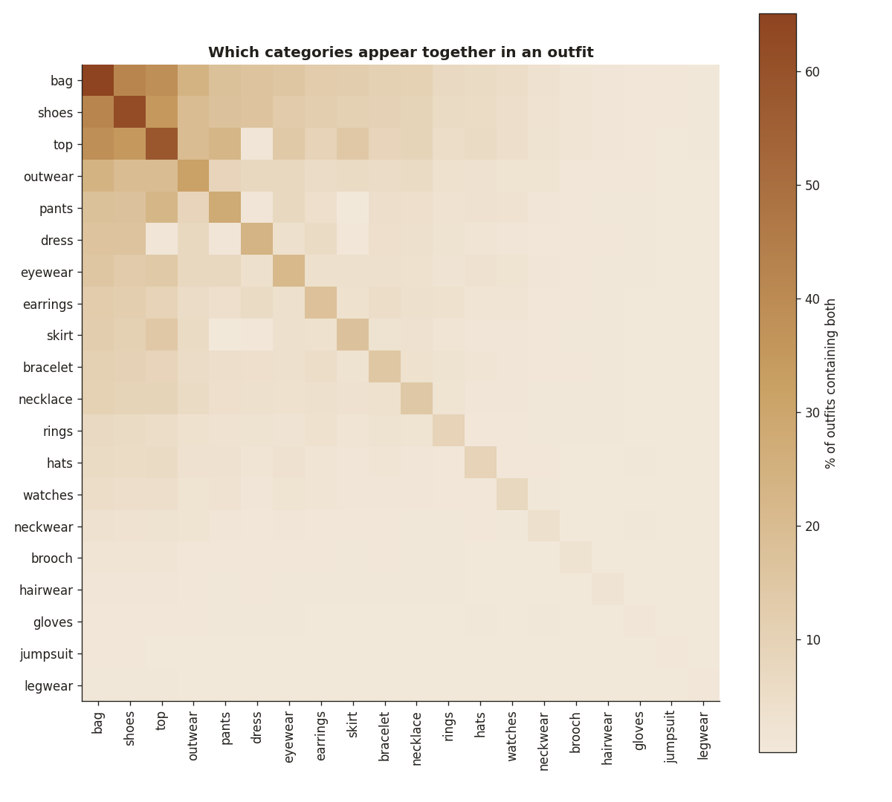
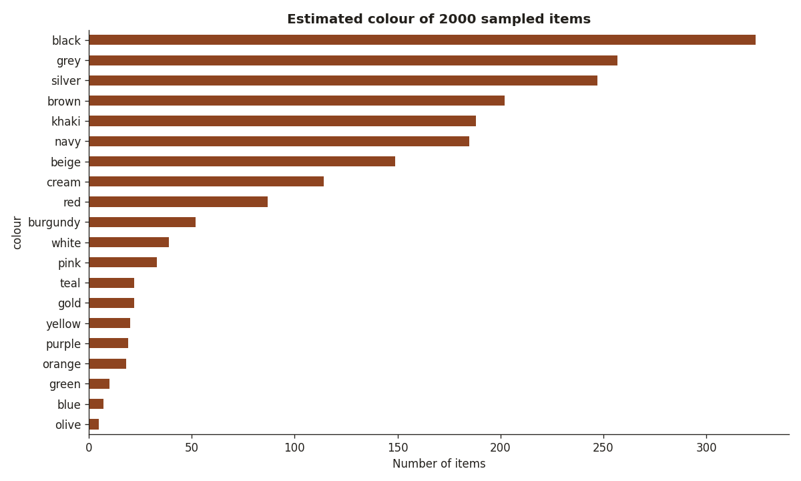
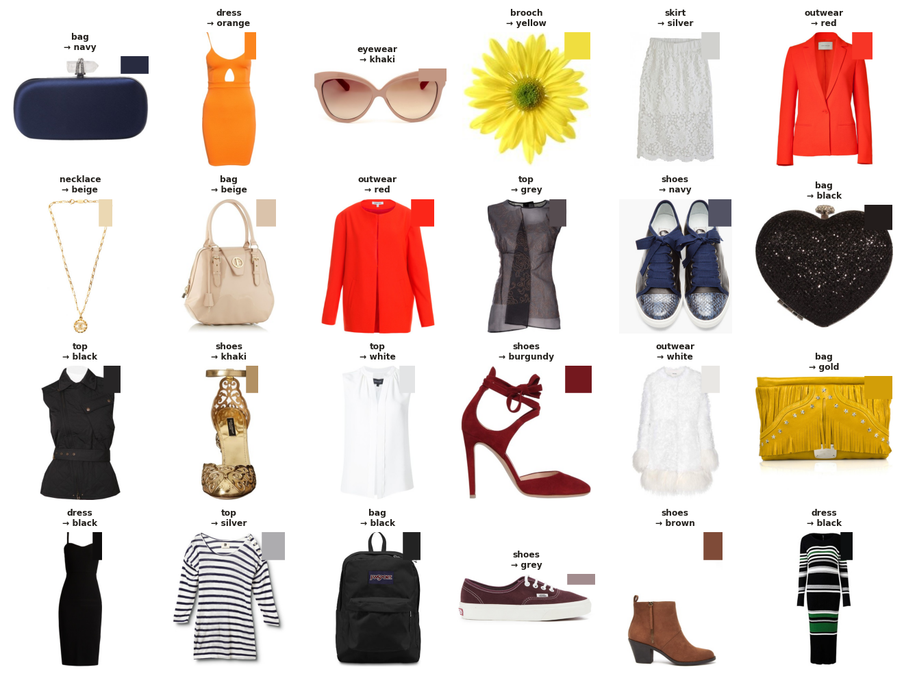
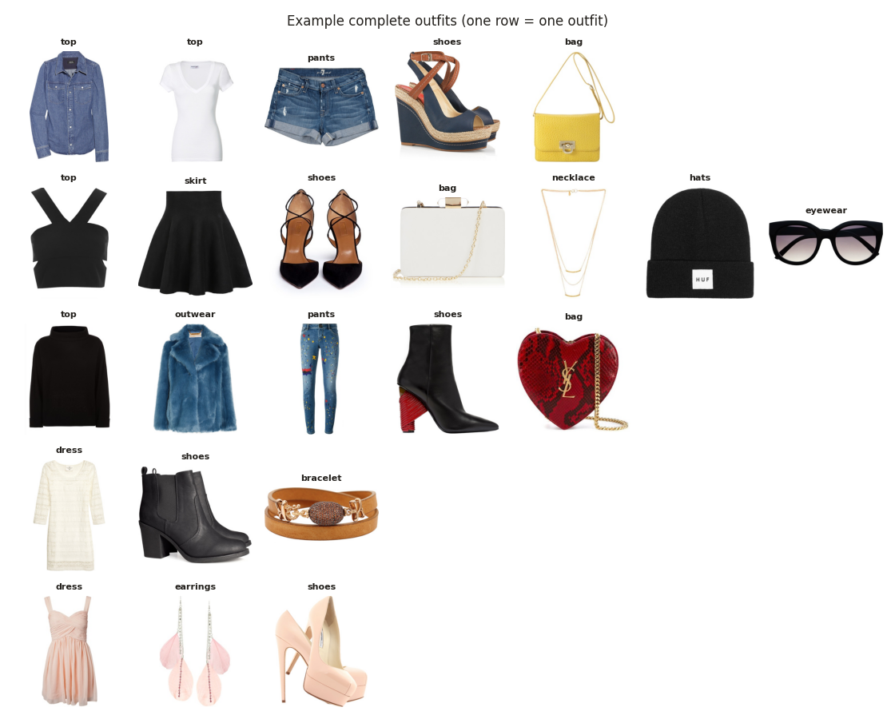

# EDA — Maryland PolyVore (Re-PolyVore)

## Size and quality

- Images: **126927** in 20 category folders.
- Junk files to ignore: 22: 20 Windows `desktop.ini`, `bag/193402192_7.jpg - Shortcut.lnk`, `pants/31456707_3 - Copy.jpg`.
- Images named without a position (`<number>.jpg`), so not linked to any outfit: 276 (bag: 275, brooch: 1). Usable for classification only.
- Unreadable / corrupt images: 0
- Exact duplicates (same bytes): 24273 extra copies in 14756 groups. 14452 groups stay in one category (the same product reused in several outfits); 304 groups span different categories (label conflicts).
- ⚠ When splitting train / val / test, all copies of an image must go to the same split, otherwise the test set leaks into training.
- No text metadata (names, descriptions, prices), no colour labels, and no official train/val/test split in this version.

- Image size: median 340x400 px; height is 400 px for 61% of images, width from 56 to 400 px.
- Colour modes: RGB: 124347, L: 2580
- White background (4 near-white corners, sample of 500): 99%.

## Class balance

| folder | count | % |
|---|---:|---:|
| bag | 21268 | 16.8 |
| shoes | 20135 | 15.9 |
| top | 19397 | 15.3 |
| outwear | 10169 | 8.0 |
| pants | 8956 | 7.1 |
| dress | 7479 | 5.9 |
| eyewear | 6680 | 5.3 |
| earrings | 5508 | 4.3 |
| skirt | 5307 | 4.2 |
| bracelet | 5174 | 4.1 |
| necklace | 4664 | 3.7 |
| rings | 3227 | 2.5 |
| hats | 2913 | 2.3 |
| watches | 2290 | 1.8 |
| neckwear | 1189 | 0.9 |
| brooch | 995 | 0.8 |
| hairwear | 692 | 0.5 |
| gloves | 386 | 0.3 |
| jumpsuit | 296 | 0.2 |
| legwear | 202 | 0.2 |

Preview in our unified `category` (folder → category, to be confirmed in the mapping step):

| category | count | % |
|---|---:|---:|
| accessory | 33920 | 26.7 |
| bag | 21268 | 16.8 |
| shoes | 20135 | 15.9 |
| top | 19397 | 15.3 |
| bottom | 14263 | 11.2 |
| outerwear | 10169 | 8.0 |
| dress | 7775 | 6.1 |

- No `traditional` items, and folder names are coarse: no sub-category (t-shirt vs shirt, jeans vs trousers) is given. Folders also mix types: `pants` holds shorts too, `top` holds shirt-jackets.

## Outfits

- Outfits (unique outfit ids): **31333**
- Items per outfit: median 4, mean 4.0, min 1, max 34. Outfits with a single item: 2053 (useless for compatibility).
- Outfits with a full set of clothes (top + bottom, or dress / jumpsuit): 60.2%; with clothes **and** shoes: **39.1%** (12249 outfits).
- Outfits with 2+ items of the same category (e.g. 2 bags): 9.8%.

- Share of outfits containing each category: bag 65%, shoes 62%, top 58%, outwear 32%, pants 28%, dress 23%, eyewear 21%, earrings 17%

## Colour distribution (estimated)

- Median colour of the non-white pixels of 2000 random images, snapped to the nearest colour of `mappings/colour_palette.csv`.
- All items: black (16.2%), grey (12.8%), silver (12.3%), brown (10.1%), khaki (9.4%), navy (9.2%), beige (7.5%), cream (5.7%)
- Clothes only (724 items): black (19.5%), silver (15.5%), grey (13.5%), cream (9.1%), navy (9.1%), red (6.5%), brown (4.8%), white (3.6%)
- Product shots on white give cleaner estimates than Fashionpedia's street photos, but white items are hard to separate from the background, and jewellery comes out as gold/silver/grey. Check the grid below.
- Main systematic error: white and very light items (white sandals, light blue socks) land on `silver`, which inflates silver. Metallic colours (silver, gold) should probably only be allowed for shoes, bags and jewellery: a team decision for the colour step.

## Example outfits

- Polyvore outfits were composed by users, so they are real examples of items that go together: the main training source for outfit compatibility.
