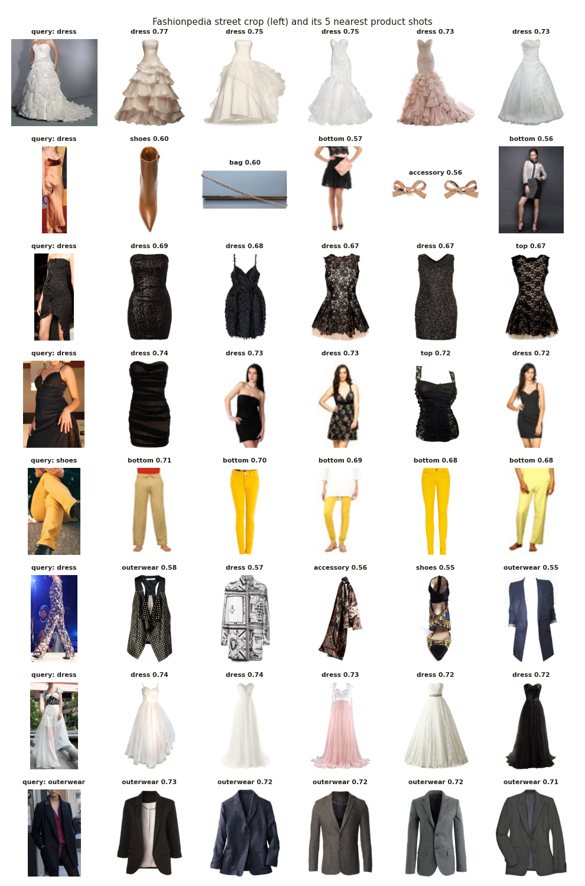

# FashionCLIP embeddings: evaluation

282,135 unique pictures / crops have a vector (`patrickjohncyh/fashion-clip`, 512 numbers each). Scores are on the 29,633 **test** pictures.

## 1. Zero-shot (no training)

Each picture is given the label whose text it is most similar to.

**category (9 classes)**

| dataset | test items | accuracy (95% CI) |
|---|---:|---:|
| Fashion Product | 3,549 | 83.6% (82–85) |
| PolyVore | 11,922 | 80.8% (80–81) |
| Fashionpedia | 14,162 | 62.2% (61–63) |
| **all** | 29,633 | 72.2% (72–73) |

**sub_category (58 classes, items that have one)**

| dataset | test items | accuracy (95% CI) |
|---|---:|---:|
| Fashion Product | 3,549 | 70.7% (69–72) |
| PolyVore | 4,268 | 71.5% (70–73) |
| Fashionpedia | 8,411 | 50.4% (49–52) |
| **all** | 16,228 | 60.4% (60–61) |

## 2. Linear probe (logistic regression on the vectors)

The baseline the EfficientNet classifier has to beat.

**category (9 classes, trained on 10,660 pictures)**

| dataset | test items | accuracy (95% CI) |
|---|---:|---:|
| Fashion Product | 3,549 | 96.3% (96–97) |
| PolyVore | 11,922 | 94.8% (94–95) |
| Fashionpedia | 14,162 | 80.8% (80–81) |
| **all** | 29,633 | 88.3% (88–89) |

Hardest category classes (at least 20 test items): top 81% (5462), dress 83% (2753), outerwear 86% (2279), bottom 88% (3619), accessory 89% (5580), bag 91% (2984).

**sub_category (57 classes, trained on 52,454 pictures)**

| dataset | test items | accuracy (95% CI) |
|---|---:|---:|
| Fashion Product | 3,549 | 88.1% (87–89) |
| PolyVore | 4,268 | 93.6% (93–94) |
| Fashionpedia | 8,411 | 69.1% (68–70) |
| **all** | 16,228 | 79.7% (79–80) |

Hardest sub_category classes (at least 20 test items): tunic 37% (68), capris 40% (53), flats 44% (50), waistcoat 55% (69), top 62% (681), cardigan 64% (121).

**pattern (5 classes, trained on 7,500 pictures)**

| dataset | test items | accuracy (95% CI) |
|---|---:|---:|
| Fashion Product | 644 | 72.4% (69–76) |
| Fashionpedia | 7,200 | 74.4% (73–75) |
| **all** | 7,844 | 74.2% (73–75) |

Hardest pattern classes (at least 20 test items): printed 62% (932), solid 75% (5683), floral 76% (404), striped 80% (455), checked 81% (370).

## 3. Colour from the vectors vs the current colour model

On unseen Fashion Product images (val + test, real labels): 70.7% (70–72) (the gradient-boosting model: 64.5% before its confidence cut).

Hand-labelled items. *Kept* = items that get a colour; the vector model keeps the same number of items as the current model (its most confident ones), so the accuracies are compared at equal coverage.

| dataset | items | kept | current model | vector model |
|---|---:|---:|---:|---:|
| PolyVore (all items) | 200 | 200 | 63.0% (56–69) | 48.5% (42–55) |
| PolyVore (current cut 0.7) | 200 | 103 | 76.7% (68–84) | 63.1% (53–72) |
| Fashionpedia (all items) | 195 | 195 | 49.7% (43–57) | 34.4% (28–41) |
| Fashionpedia (current cut 0.7) | 195 | 85 | 65.9% (55–75) | 42.4% (32–53) |

Most frequent mistakes of the vector model: black → navy (14), white → cream (13), black → brown (10), black → grey (10), white → grey (9), navy → blue (8).

## 4. Retrieval: street photo → product shots

For 300 Fashionpedia test crops (clothes, shoes, bags, at least 128 px), **65%** of the 5 nearest product shots have the same category as the street item.

The category shown for a query is Fashionpedia's label; a few crops are noisy (e.g. a 'shoes' box that mostly shows the trousers above them), which lowers the score.
