# EDA — Fashionpedia

## What this dataset brings to DressMe

**Features it brings:**

- real-life worn items with a bounding box (cropped for the models)
- pattern from the `textile pattern` attribute
- sub_category from the `nickname` attribute (kaftan → traditional)
- `coverage` (modesty, 1-5) from item length + linked sleeve / neckline parts
- outfits: every photo is one outfit (`outfit_id`)
- no colour label: colour is estimated

**How the project uses it:**

- trains the classifier on crops closer to real photos than catalogue shots
- coverage for the modest filter of the style profile (`min_coverage`)
- compatibility evaluation (AUC / FITB on the test photos)
- street → shop retrieval check of the FashionCLIP embeddings

Field-by-field mapping: [dataset_feature_map.md](dataset_feature_map.md)

## Size and quality

| split | images | images on disk | objects | whole items | parts |
|---|---:|---:|---:|---:|---:|
| train | 45623 | 45623 | 333401 | 163060 | 170341 |
| val | 1158 | 1158 | 8781 | 4688 | 4093 |
| test | 2044 | – | no labels (public test set) | – | – |

- Categories: 46 (27 whole items, 19 parts); attributes: 294 in 11 groups.
- Images with no annotation: 0; with no whole item: 1.
- Whole items with no attribute at all: 53.0% (mostly shoes and accessories; clothes are well annotated, see below).
- Masks stored as compressed RLE (crowd) instead of polygons: 11534 (3.4%).
- **No colour label** in Fashionpedia: colour must be estimated from pixels (see below) or predicted by a model.

- Image size: median 682x1024 px, min short side 232 px, max long side 1024 px.

## Class balance

### Whole items

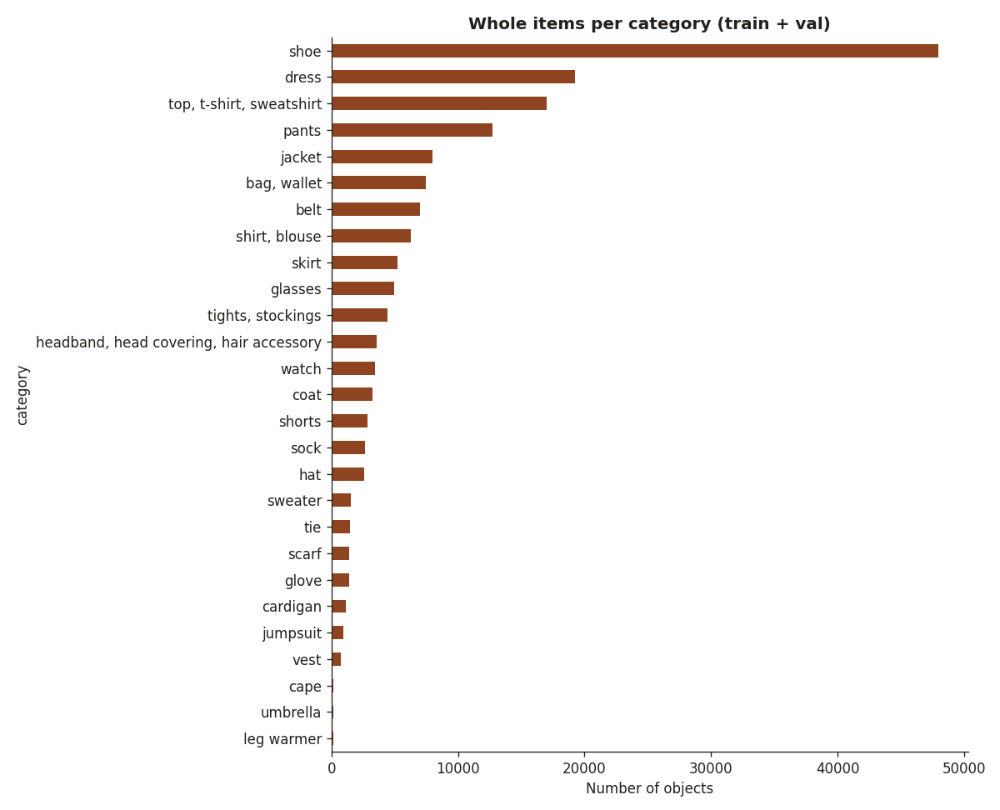

| category | objects | % | images containing it |
|---|---:|---:|---:|
| bag, wallet | 7431 | 4.4 | 7112 |
| belt | 7015 | 4.2 | 6826 |
| cape | 157 | 0.1 | 157 |
| cardigan | 1119 | 0.7 | 1113 |
| coat | 3228 | 1.9 | 3188 |
| dress | 19247 | 11.5 | 19172 |
| glasses | 4985 | 3.0 | 4978 |
| glove | 1416 | 0.8 | 775 |
| hat | 2592 | 1.5 | 2588 |
| headband, head covering, hair accessory | 3579 | 2.1 | 3089 |
| jacket | 8016 | 4.8 | 7921 |
| jumpsuit | 943 | 0.6 | 943 |
| leg warmer | 126 | 0.1 | 68 |
| pants | 12728 | 7.6 | 12660 |
| scarf | 1422 | 0.8 | 1410 |
| shirt, blouse | 6263 | 3.7 | 6217 |
| shoe | 47940 | 28.6 | 24758 |
| shorts | 2862 | 1.7 | 2851 |
| skirt | 5208 | 3.1 | 5196 |
| sock | 2669 | 1.6 | 1496 |
| sweater | 1515 | 0.9 | 1506 |
| tie | 1460 | 0.9 | 1458 |
| tights, stockings | 4448 | 2.7 | 2264 |
| top, t-shirt, sweatshirt | 17025 | 10.1 | 16639 |
| umbrella | 140 | 0.1 | 139 |
| vest | 741 | 0.4 | 738 |
| watch | 3473 | 2.1 | 3455 |

### Garment parts

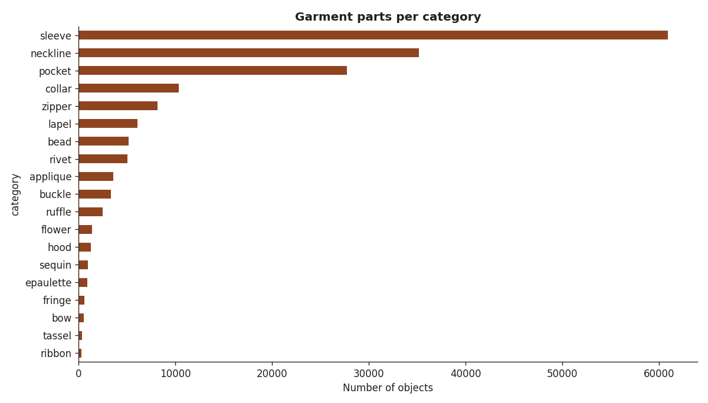

- Shoes are labelled one per foot (47940 shoe objects in 24758 images), so they look bigger than they are.

- 174434 part objects (sleeve, neckline, pocket...). Not classes for DressMe, but useful for `coverage`: neckline types (v-neck, off-the-shoulder...) are attached to the 35187 'neckline' part objects, not to the garment itself, and 'sleeve' parts carry the sleeve length. They must be linked back to their garment (same image, overlapping box) during mapping.

### Items per image

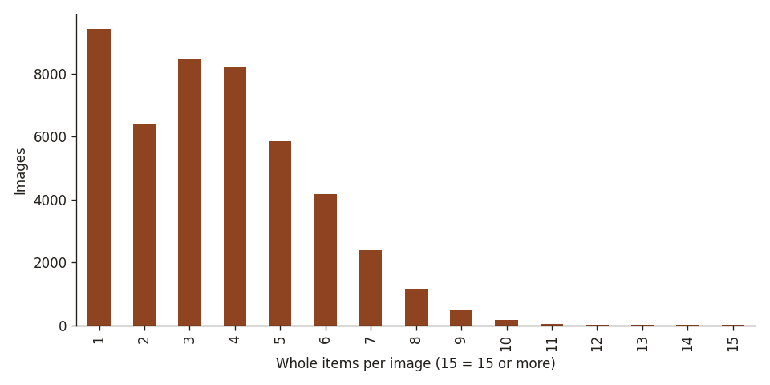

- Median 3, mean 3.6, max 20 items per image: each image is a full outfit, useful for outfit compatibility.

## Attributes

Share of whole items with at least one attribute of each group:

| attribute group | count | % |
|---|---:|---:|
| silhouette | 75229 | 44.8 |
| textile finishing, manufacturing techniques | 75100 | 44.8 |
| textile pattern | 74368 | 44.3 |
| non-textile material type | 73304 | 43.7 |
| length | 67304 | 40.1 |
| waistline | 62170 | 37.1 |
| nickname | 50498 | 30.1 |
| opening type | 45735 | 27.3 |
| animal | 591 | 0.4 |
| leather | 204 | 0.1 |
| neckline type | 33 | 0.0 |

### textile pattern → `pattern`

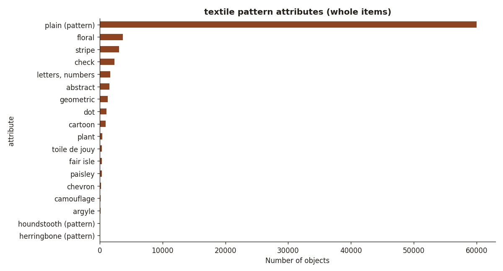

- 18 values used, on 74368 items (44.3% of whole items).
- Top 10: plain (pattern) (60005), floral (3704), stripe (3076), check (2329), letters, numbers (1683), abstract (1559), geometric (1298), dot (1103), cartoon (916), plant (438)

### length → `coverage` (with neckline / sleeve)

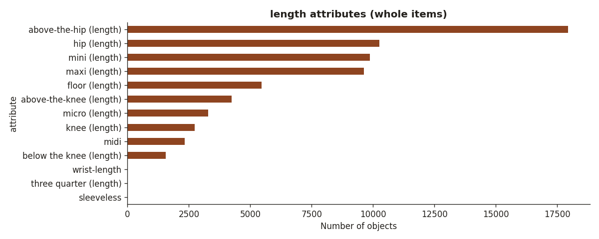

- 13 values used, on 67304 items (40.1% of whole items).
- Top 10: above-the-hip (length) (17946), hip (length) (10253), mini (length) (9879), maxi (length) (9632), floor (length) (5457), above-the-knee (length) (4237), micro (length) (3294), knee (length) (2728), midi (2337), below the knee (length) (1558)

### nickname → `sub_category`

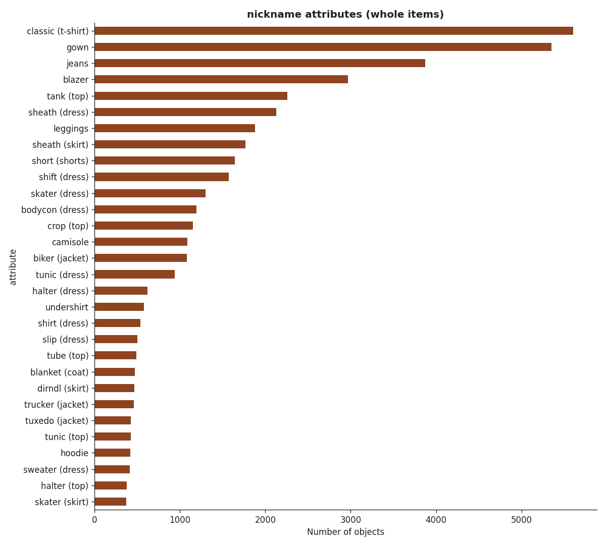

- 118 values used, on 50498 items (30.1% of whole items).
- Top 10: classic (t-shirt) (5603), gown (5349), jeans (3873), blazer (2967), tank (top) (2259), sheath (dress) (2127), leggings (1877), sheath (skirt) (1766), short (shorts) (1640), shift (dress) (1574)

### silhouette → style hints (fit)

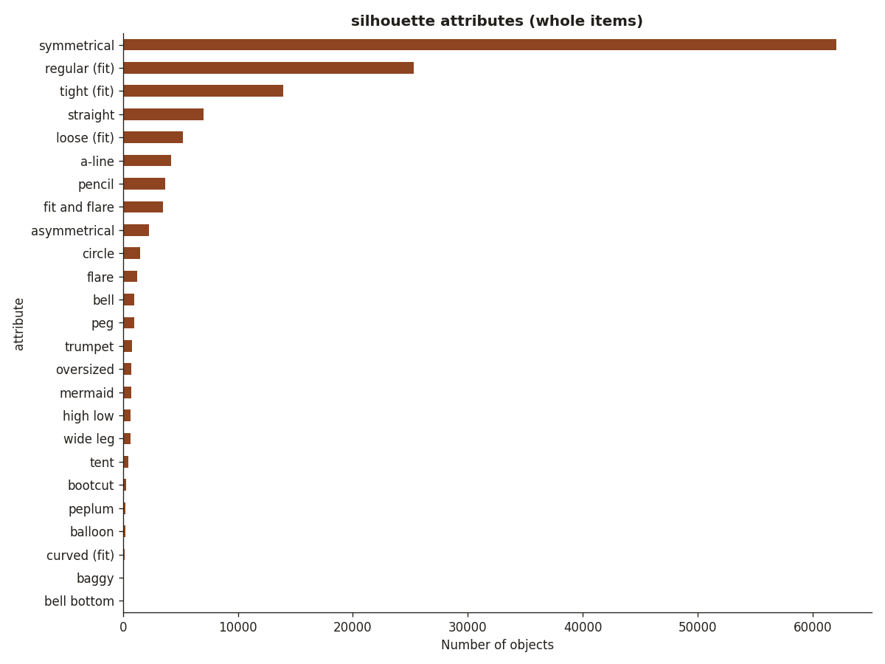

- 25 values used, on 75229 items (44.8% of whole items).
- Top 10: symmetrical (62048), regular (fit) (25296), tight (fit) (13906), straight (7037), loose (fit) (5208), a-line (4212), pencil (3671), fit and flare (3468), asymmetrical (2277), circle (1508)

- Clothes (categories 0-12) with a textile pattern attribute: 94.1%. The others have no pattern info.

## Item crop sizes

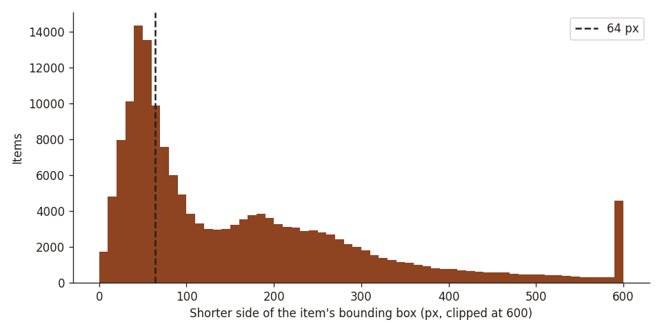

- Items with a crop shorter than 64 px: **33.8%**: probably too small to classify, candidates to drop.
- Most affected: watch (93%), sock (90%), glasses (87%), tie (83%), headband, head covering, hair accessory (71%), shoe (68%)

## Colour distribution (estimated)

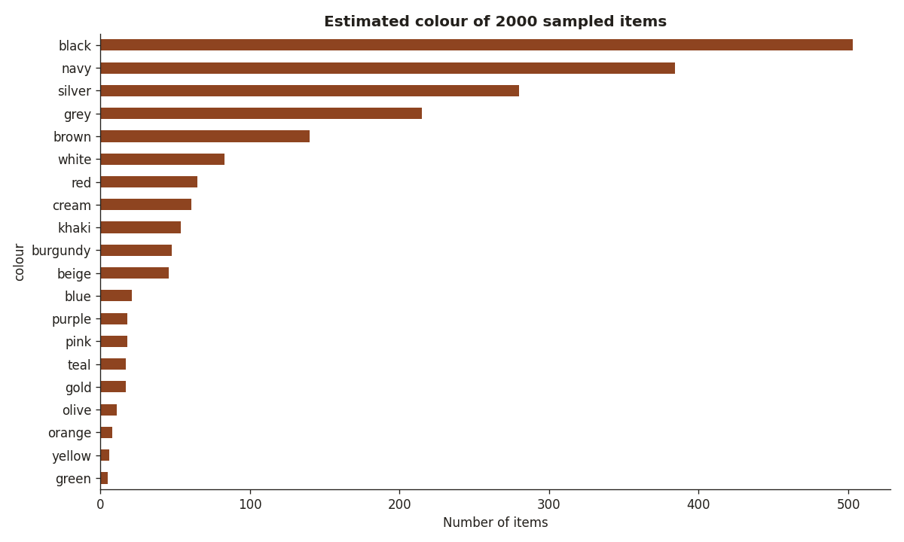

- Median pixel colour inside 2000 random masks of clothes (categories 0-12, crop ≥ 64 px), snapped to the nearest colour of `mappings/colour_palette.csv` (Lab distance).
- Top: black (25.1%), navy (19.2%), silver (14.0%), grey (10.8%), brown (7.0%), white (4.2%), red (3.2%), cream (3.0%)
- Black share: 25.1% (Kaggle catalogue: 21.9%; survey: black in 84% of wardrobes).
- Only an estimate: shadows and prints push colours towards grey/brown, white in shadow often becomes 'silver' or 'grey', and 'multicolour' can never be predicted this way. Check the sample grid below before trusting it.

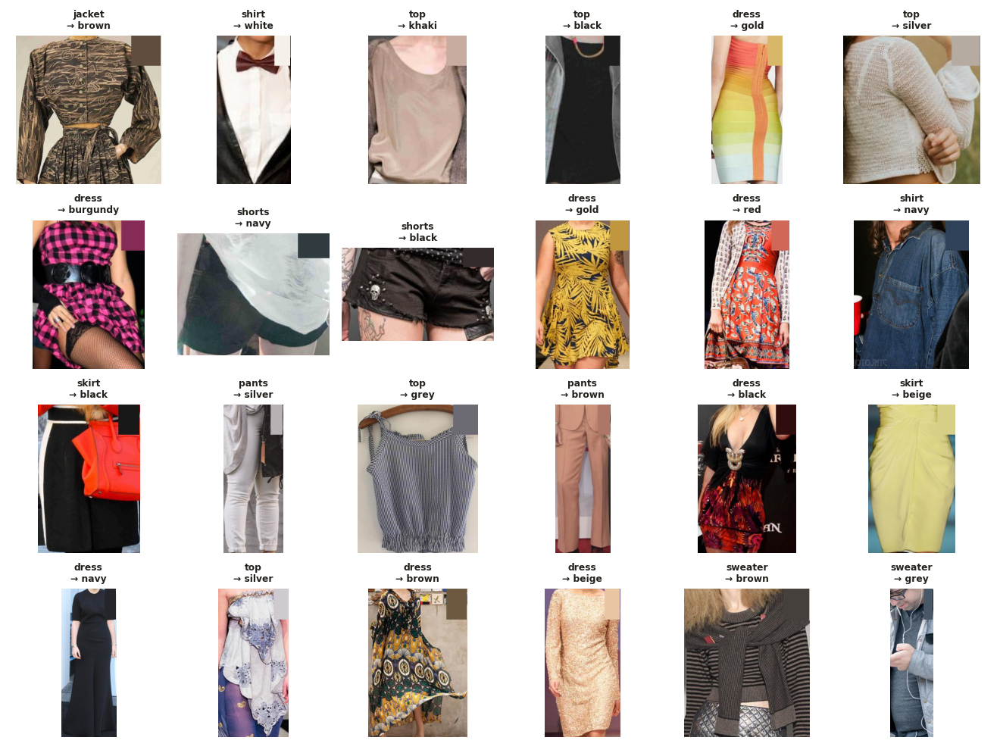

## Example images

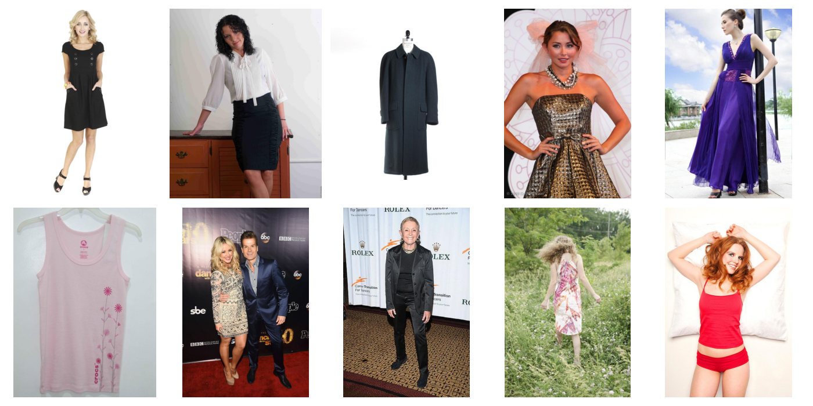

- Street and runway photos of people wearing outfits: much closer to real life than the Kaggle catalogue shots, but items must be cropped out first.
