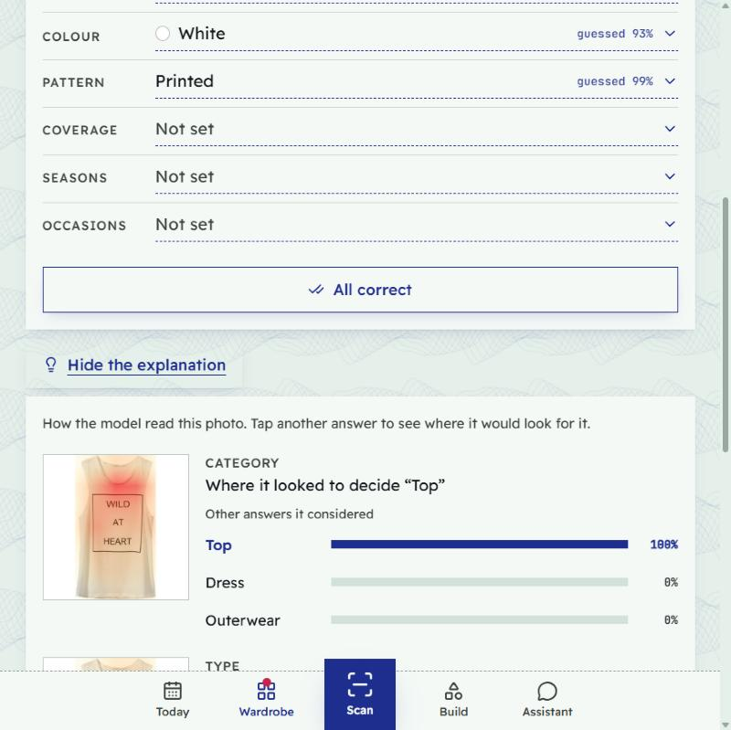
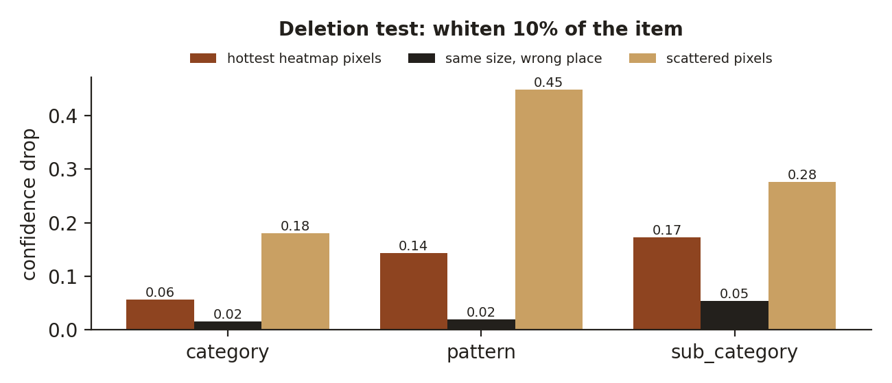
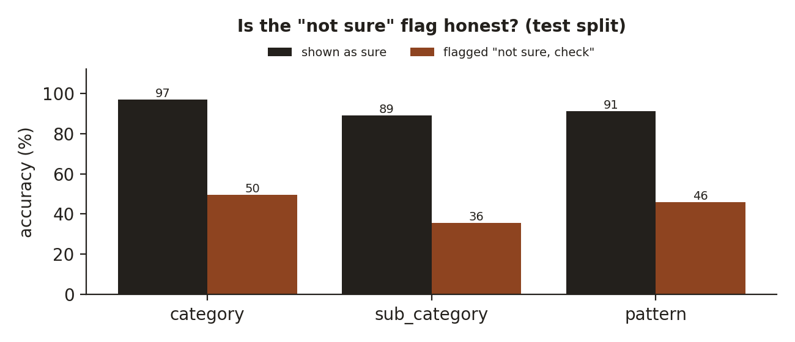
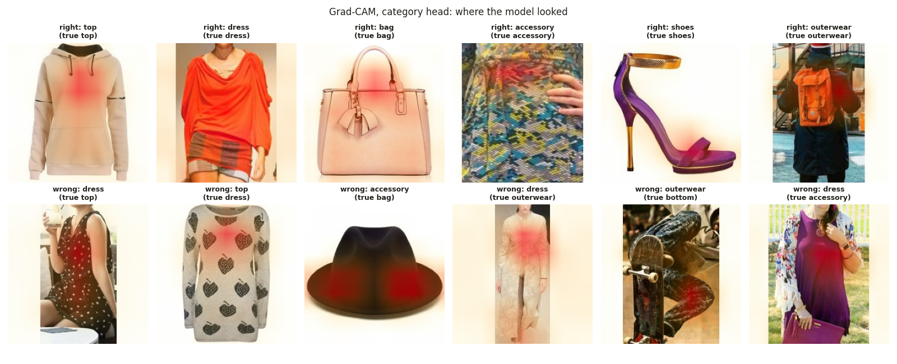
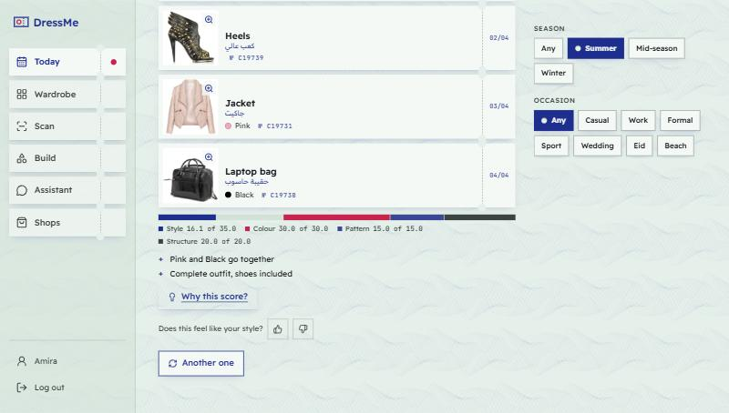
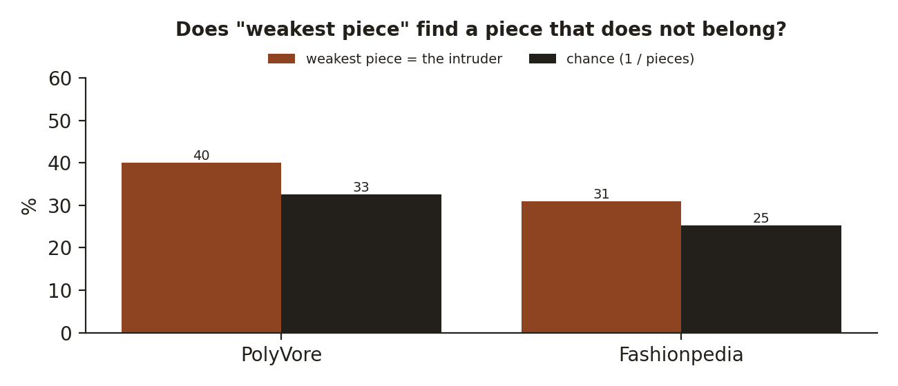
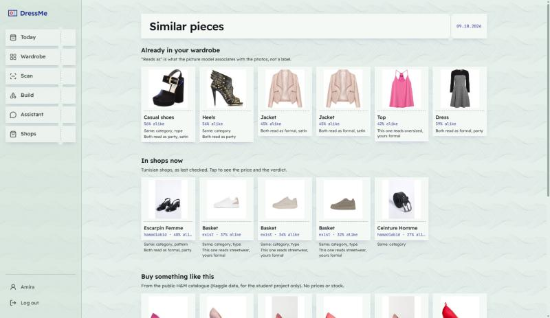
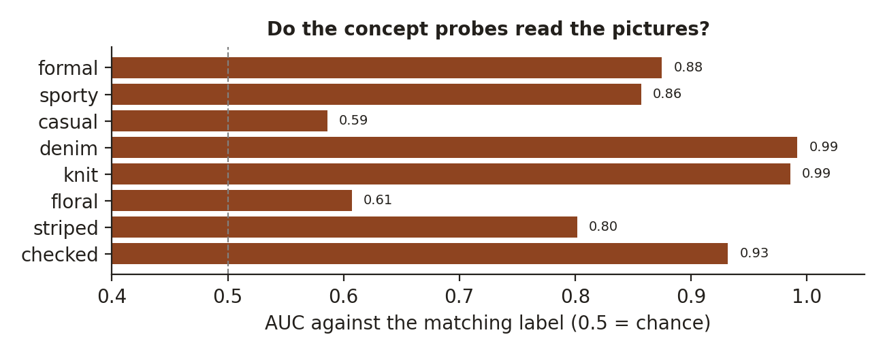
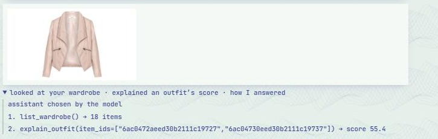
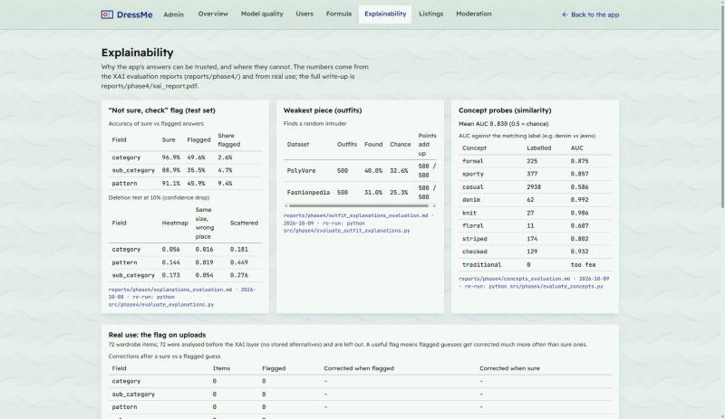

# DressMe — Explainability (XAI) report

Generated 2026-10-09 by `src/phase4/build_xai_report.py` (PDF: `xai_report.pdf`).

## 1. Why DressMe explains itself

DressMe's users are young Tunisians on a small budget who buy mostly second-hand (friperie) pieces that can rarely be returned; 42% of our survey wanted a straight "should I buy this?" answer. An answer they cannot check is an answer they cannot trust, and a wrong label or score costs them money. So every answer of the app can say **why**, in English, French and Arabic, and the team can see **how far each explanation can be trusted**.

The rule we kept throughout: an explanation shows how the existing answer was made. It never changes a score, and it never invents a reason the model or the formula did not use. Where an explanation is only an association (a picture model's concepts) or a visual aid (the colour map), the app says so.

## 2. What is explained, how, and the evidence

| Explanation | Method | In the app | Evidence |
|---|---|---|---|
| Why this label | Grad-CAM heatmap (= CAM for our linear heads), top 3 answers | "Why these labels?" on item and scan pages | deletion test: heatmap beats a same-size region elsewhere for every field |
| "Not sure, check" | best answer below a cut, or too close to the 2nd (team cuts) | badge on the field | flagged answers 50% right vs 97% (category) |
| Colour | item pixels nearest to the colour (visual aid) | same panel | not the colour model's reasoning (it reads a histogram); said in the app |
| Outfit score | points per part, + / − lines from the team's rule tables | every outfit card | points add up to the score: 500 / 500 outfits |
| Weakest piece | best swap from the wardrobe (re-scores the outfit) | "Why this score?" (Build, Today) | finds an intruder 40% vs 33% chance |
| Buy verdict | good outfits vs the team thresholds, what it beats, near misses | "Why this verdict?" (Scan, Shop) | exact: re-uses the verdict's own numbers |
| Look-alikes | shared labels + FashionCLIP concept probes above the average picture | Similar page chips | concepts recover known labels, mean AUC 0.83 |
| Chat answers | Explainer agent (6 tools) + "How I answered" trace | Assistant | grounded answers with the base model (live test); trace = real calls |

## 3. Item labels: why this label?

The classifier (EfficientNet-B0, three heads) answers category, type and pattern. `src/phase4/explain.py` draws where it looked with Grad-CAM. Our heads are one linear layer on the averaged feature maps, so Grad-CAM equals the classic CAM: the heatmap is exact for the model, nothing is approximated. All heads share one body, so a heatmap shows where the model looked to decide, not the outline of a part. The user can tap another answer ("why not a dress?") to see where the model would look for it.

*The "Why these labels?" panel: heatmaps, top 3 answers, colour pixel map (demo account).*

Is the heatmap faithful? We whitened the hottest 10% of the item's pixels and measured how much the model's confidence dropped, against the same share of pixels in a solid region in the wrong place, and against scattered random pixels.

*The heatmap region matters 2-7x more than a same-size region elsewhere. Scattered pixels drop the confidence most: they cover the item with noise the model never saw, which says nothing about where it looks.*

The "not sure, check" flag: a field is flagged when its best answer is below the team's cut or less than `margin` ahead of the second. On the test split:

*Flagged answers are right only 36-50% of the time, sure ones 89-97%; the flag catches 2.6-9.4% of the answers.*

*Grad-CAM examples from the test split, right and wrong answers.*

## 4. Outfit scores and buy verdicts

The score is the team's weighted formula (`src/phase4/compatibility.py`). `src/phase4/explain_outfit.py` splits it into the points each part earned and could have earned; the rounding keeps the sum exactly equal to the score shown. Strengths and problems come from the same rule tables as the score, as codes the app turns into sentences (en / fr / ar).

*An outfit card: points per part, what works, "Why this score?".*

"Why this score?" names the weakest piece: for each piece, the best replacement from the user's wardrobe and how many points it adds (only above the team's `min_swap_gain`). On Build, "Apply swap" makes it. To test it, we replaced one piece of each test outfit by a random item of the same category:

*Above chance on both datasets, but modestly: the swap re-uses the score, so it is only as sharp as the formula itself (compatibility AUC 66.6% PolyVore, 78.7% Fashionpedia).*

"Why this verdict?" shows the count of good outfits against the team's thresholds ("9 good outfits; Buy needs 5"), which owned piece the new one beats and by how much, the owned pieces that do as well, near misses and near twins with their pictures.

## 5. Look-alikes: why two pieces are alike

DressMe finds look-alikes with FashionCLIP picture vectors only. Each one now says which labels both pieces share, and what the picture model associates with both: the team's list of short texts (`mappings/style_concepts.csv`) is compared with each picture. Concepts are ranked above the average picture; without that, a generic prompt such as "trendy" topped nearly every piece.

*The Similar page: "Same: category, type", "Both read as party, satin", or a contrast.*

*Concepts that match an existing label recover it well (denim vs jeans, knit vs sweaters). Floral has only 11 labelled test pictures; casual is the majority class. 11 concepts have no label to check.*

## 6. The Explainer agent and "How I answered"

A fifth chat agent (`backend/app/agents/explainer.py`) answers "why?" questions with tools on the user's real data: `explain_outfit`, `what_if`, `explain_labels`, `explain_similarity`, `explain_verdict`, `how_scoring_works`. Its prompt: give only reasons found in a tool result, never invent a rule, a number or a cause; labels are guesses with a confidence. A piece can be named by description ("pink top") only when exactly one piece matches; otherwise it asks which one.

Every chat answer keeps a trace of its tool calls (agent, how it was chosen, each call with a one-line result), shown under the answer:

*"How I answered": the Explainer listed the wardrobe, then scored the outfit (55.4).*

Live tests on the demo wardrobe: the base model (qwen3:4b-instruct) gave grounded answers (the real points per part; the shared labels and concepts of two jackets) and asked which piece when a description was ambiguous. The fine-tuned dressme-chat-v2 was trained before `explain_similarity` existed: asked about two jackets it did not call the tool and made up a reason. Its next training run must include the newest tools.

## 7. Admin > Explainability

The same numbers for the team, plus real use: how often each field is flagged on real uploads and how often users corrected flagged vs sure guesses, which tools the chat agents call and how often they fail, and the XAI settings (`mappings/xai_settings.csv`), editable like the formula weights.

*Admin > Explainability.*

## 8. Limitations

- Concepts are what the picture model associates with a photo, not facts; 11 of 20 cannot be checked against a label.
- The colour map is a visual aid: the colour model reads a histogram of all the item's colours, and white / cream items blend into the white background (no map then).
- "Weakest piece" is limited by the formula's own signal (modest gain over chance).
- The "not sure" cuts and every XAI threshold are start values (REVIEW), measured on the test split of public datasets; real-use calibration starts with uploads made after the XAI layer (the demo wardrobe predates it).
- dressme-chat-v2 does not know the newest Explainer tools yet; the Darija text of the app and of the chat data still needs the native-speaker review.
- All evaluations use public product shots; our own phone photos (Local) are not in them yet.

## 9. Open team decisions

| File | Setting | Value | Note |
|---|---|---|---|
| xai_settings.csv | min_conf_category | 0.6 | start value; below it the app says "not sure, check" (see reports/phase4/explanations_evaluation.md) |
| xai_settings.csv | min_conf_sub_category | 0.5 | start value; sub_category has many close classes |
| xai_settings.csv | min_conf_pattern | 0.6 | start value |
| xai_settings.csv | min_conf_colour | 0.7 | same as MIN_CONFIDENCE in estimate_colours.py (the empty-colour rule does not change) |
| xai_settings.csv | margin | 0.15 | also unsure when the best answer leads the second by less than this |
| xai_settings.csv | strength_style | 0.7 | outfit style coherence (0-1) from which the app says "the pieces share one style" |
| xai_settings.csv | strength_colour_pair | 0.8 | colour pair score from which the app says "navy and white go together" |
| xai_settings.csv | near_miss | 5 | buy advice: outfits this many points below good_outfit count as near misses |
| xai_settings.csv | min_swap_gain | 2 | outfit swaps: a swap must gain at least this many points before the app names a weakest piece |
| style_concepts.csv | 20 concepts |  | streetwear, formal, sporty, casual, classic, modest, trendy, party, denim, leather, knit, lace, satin, oversized, fitted, floral, striped, checked, vintage, traditional |

## 10. How to reproduce

- `python src/phase4/evaluate_explanations.py` → `reports/phase4/explanations_evaluation.md` (2026-10-08)
- `python src/phase4/evaluate_outfit_explanations.py` → `reports/phase4/outfit_explanations_evaluation.md` (2026-10-09)
- `python src/phase4/evaluate_concepts.py` → `reports/phase4/concepts_evaluation.md` (2026-10-09)
- `python src/phase4/build_xai_report.py` → this report

